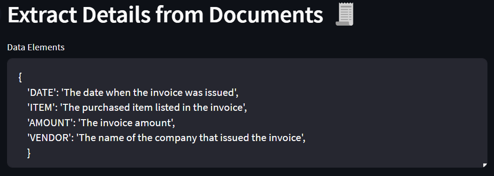
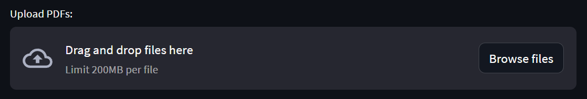
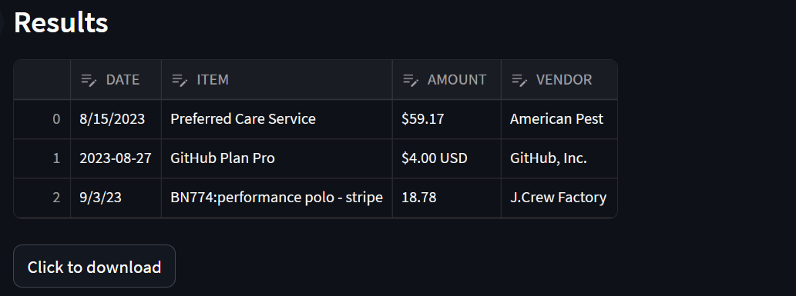
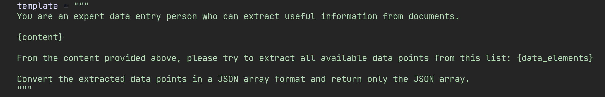

# 📄 Document Parser for Reciepts and Invoices

This code repository is for **a document parser app** that can read data from PDF files of recipets or invoices and extract specific details from them, e.g., invoice date, invoice amount.

By default, it will extract the following items (if available):
* **DATE**: The date when the invoice was issued,
* **ITEM**: The purchased item listed in the invoice,
* **AMOUNT**: The invoice amount, and
* **VENDOR**: The name of the company that issued the invoice.

You can easily change these parameters either directly on the web app (before uploading documents) or in the source code.

## 🚀 Instructions to Launch the App

<b>Show instructions</b>

Once you make a copy of this codebase on your computer, activate a Python virtual environment using the following command:

`python -m venv .venv --prompt doc-parser`

Once the Python virtual environment is created, activate it and install all dependencies from `requirements.txt`.

`source .venv/bin/activate`

`pip install -r requirements.txt`

Once all dependencies are installed, you can launch the app using the following command:

`streamlit run src/app.py`

In a few seconds the app will be lanuched in your browser. If that doesn't happen automatically, you can copy the URL that's printed in the output.

## 🔑Config

<b>Show config settings</b>

This app makes a call to the OpenAI API. You will need to get the API key from [OpenAI] and store it locally in the `.env` file.

In addition, you will also need an API key from [HuggingFace], and that key should also be stored in the same file. See below:

	

[OpenAI]:      https://openai.com
[HuggingFace]: https://huggingface.co

## 🤔How to Use the App

<b>Show instructions</b>

Once the app is launched in a browser, you will see the following list of default parameters:

	

These are the elements that the app will try to extract from the uploaded documents. You can change these elements if you would like anything different, e.g. invoice number.

You can then upload PDF documents by either clicking on the **Browse files** button or by draggin and dropping files directly. Please be aware of the size limitation.

	

Once the files are uploaded, you will get results in a few minutes. Here's a sample result from three reciepts:

	

You can download the results as CSV file by clicking on the **Click to Download** button.

## ⚙️How It Works

Each uploaded PDF document first gets converted into an image (by using `pypdfium2`). This is because it's easier to extract text from images rather than from PDF documents.

Then from these images, each line of raw (and messy!) text is extracted (by using `pytesseract`).

This raw text is then sent to GPT-3.5 via the OpenAI API with the following prompt:

	

Where `content` is all the extracted text and `data_elements` are the default parameters discussed above.

The GPT-3.5 model parses through the text and extracts the requested data elements (as long as they are available). The JSON results are then converted into a pandas dataframe and displayed on the app UI.

Please note that the app uses **gpt-3.5-turbo-0613** from OpenAI.

## 💡Potential Improvements

Of course, this app is far from perfect. Here are some improvements that can enhance the functionality to utility of this app:

1. Format all dates and dollar amounts so that they are consistent. 
2. Enable the user to make changes to the results that are displayed on the UI before exporting. Currently, the user _can_ make changes to the results but they are not persisted to the exported dataset.
3. Include some error handling. Currently, there are no proper safeguards against invalid files or when the requested elements are not found in the uploaded files.

### ❤️Credit

My **hearfelt thanks** to this wonderful video tutorial by [AIJason](https://youtu.be/v_cfORExneQ?si=A04p7JzF2v9cDaKk).
